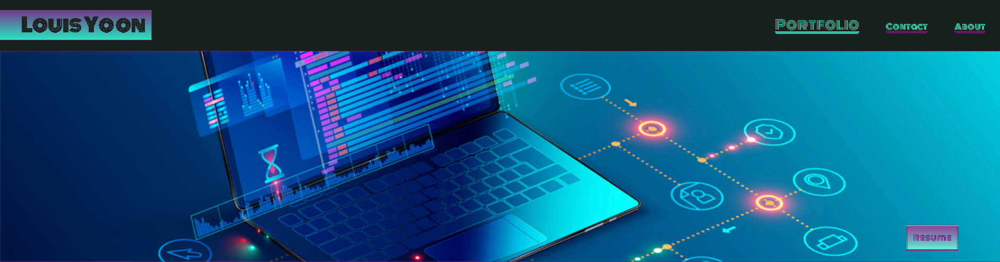
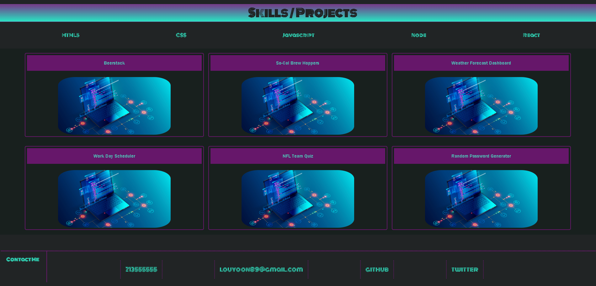

# React Portfolio V2
UCSD Full-Stack Flex Bootcamp - React Portfolio 2
University of California San Diego Cohort 2022-2023

Build a portfolio using "create-react-app" 

# Table of Contents
- [Screenshots](#screenshots)
- [Installation and Usage](#installation-and-usage)
- [Project Link](#project-link)
- [Contributing](#contributing)

# Screenshot



# Installation and Usage

To install the project follow these steps:

Clone the application from GitHub with:
```
git clone [link from GitHub]
```
From the root folder, install the dependencies with:
```
npm install
```
Run the app with:
```
npm start
```

# Project Link

GitHub repository: https://github.com/louyoon89/LYPortfolioReact  

Live Link:  https://louyoon89.github.io/LYPortfolioReact/